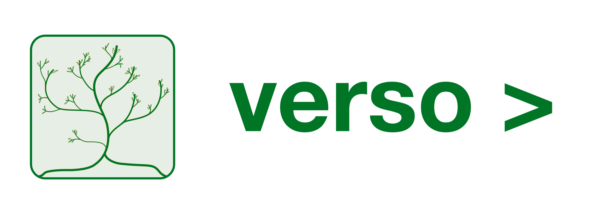

# verso

Simple [CHANGELOG]("https://keepachangelog.com") [semver]("https://semver.org/") extractor library written in Go language. If you are interested in a CLI using verso have a look at [verso.cli](https://github.com/hkionline/verso.cli)

## Usage

```go
import "github.com/hkionline/verso"

changelog, err := verso.Parse("path/to/CHANGELOG.md")
```
